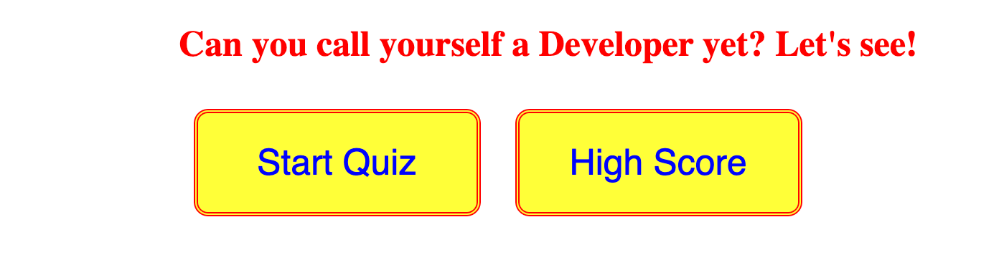
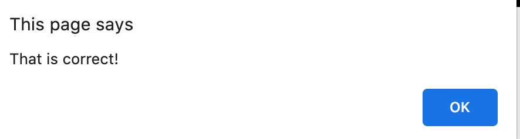

# homework4

***Description***

This website was designed to test the knowledge of a beginning Web Developer. 


It is set up in a multiple choice  quiz form. Users get 86 seconds to answer 8 basic developer  questions. After 


***Installation***

To access the password generator use the following html: 

_______

***Usage***

The first page of the website has a header and two buttons. 

The header is designed to seek the attention of the user.
Once clicked the ```Start Quiz``` button takes users to the 1st of 8 questions. This button also starts the 86 second timer. The timer goes down by the second unless the user gets it wrong then it skips 8 seconds. 

The ```High Score``` buttong allows users to see the scores of recent users. 
If you want to challenge yourself and set a goal score before taking the quiz , you can click on the ```High Score ``` button to see what other users have gotten. 


The questions are at the top in red letters. Below the question there is 4 yellow buttons. Each button has possible answers inside. Once you select your answer it takes you to the next question whether it was right or wrong. It will alert you one of the following depending on your accuracy.




 The 8 questions go in the following order: 


After the user answers all 8 questions , they will be given their score out of 8. There will be a box for users to put their initials. The submit button saves the score. All high scores can be seen after you submit your score. 


The final page shows initials and scores of users who have taken the quiz. It also allows users to Play Again or Clear the High Scores.
The ```Play Again``` buttton takes you back to the original homescreen to start the quiz over.
The ```Clear Highscore``` button clear all the saved scored. 


